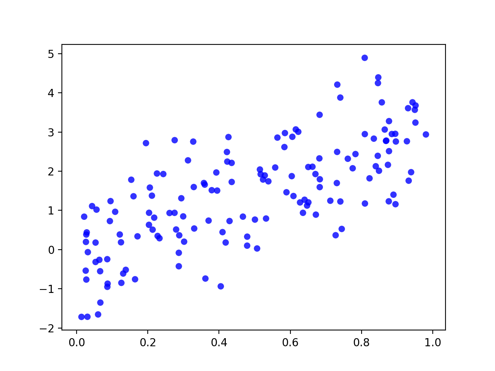

# data-generation
This repo contains methods for generating continuous and categorical data.

### Continuous data for linear regressions
Produces data with a linear relationship 

### Categorical cluster data
Produces k random clusters with Multinomial distribution

